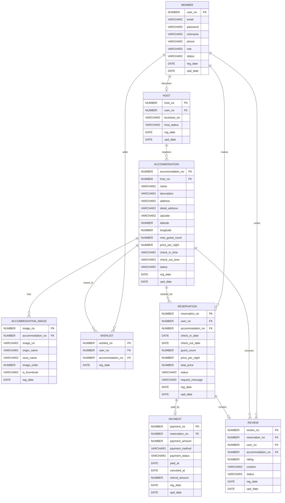

ST
NUMBER
host_no
PK
NUMBER
user_no
FK
VARCHAR2
business_no
VARCHAR2
host_status
DATE
reg_date
DATE
upd_date
ACCOMMODATION
NUMBER
accommodation_no
PK
NUMBER
host_no
FK
VARCHAR2
name
VARCHAR2
description
VARCHAR2
address
VARCHAR2
detail_address
VARCHAR2
zipcode
NUMBER
latitude
NUMBER
longitude
NUMBER
max_guest_count
NUMBER
price_per_night
VARCHAR2
check_in_time
VARCHAR2
check_out_time
VARCHAR2
status
DATE
reg_date
DATE
upd_date
ACCOMMODATION_IMAGE
NUMBER
image_no
PK
NUMBER
accommodation_no
FK
VARCHAR2
image_url
VARCHAR2
origin_name
VARCHAR2
save_name
NUMBER
image_order
VARCHAR2
is_thumbnail
DATE
reg_date
WISHLIST
NUMBER
wishlist_no
PK
NUMBER
user_no
FK
NUMBER
accommodation_no
FK
DATE
reg_date
RESERVATION
NUMBER
reservation_no
PK
NUMBER
user_no
FK
NUMBER
accommodation_no
FK
DATE
check_in_date
DATE
check_out_date
NUMBER
guest_count
NUMBER
price_per_night
NUMBER
total_price
VARCHAR2
status
VARCHAR2
request_message
DATE
reg_date
DATE
upd_date
PAYMENT
NUMBER
payment_no
PK
NUMBER
reservation_no
FK
NUMBER
payment_amount
VARCHAR2
payment_method
VARCHAR2
payment_status
DATE
paid_at
DATE
canceled_at
NUMBER
refund_amount
DATE
reg_date
DATE
upd_date
REVIEW
NUMBER
review_no
PK
NUMBER
reservation_no
FK
NUMBER
user_no
FK
NUMBER
accommodation_no
FK
NUMBER
rating
VARCHAR2
content
VARCHAR2
status
DATE
reg_date
DATE
upd_date
becomes
registers
has
adds
saved_in
makes
booked_for
paid_by
writes
receives
creates